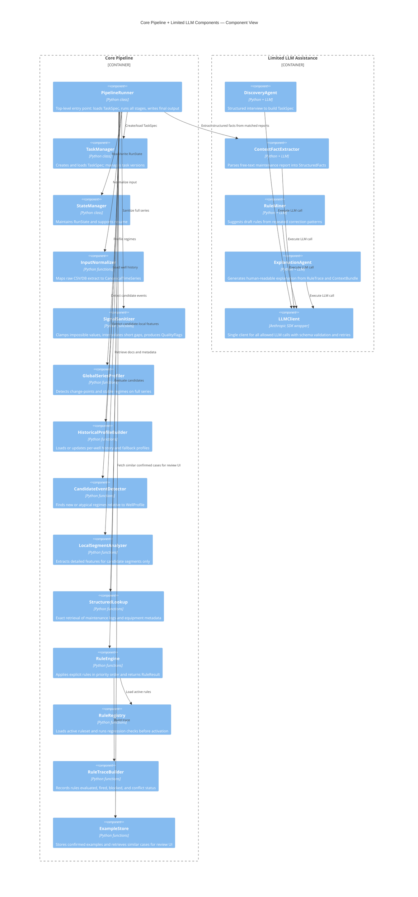

# C4 Component Diagram

Zooms into the core pipeline and limited LLM-assisted components.



## DiscoveryAgent Flow

```text
receive(task_id, existing_task_memory_or_none)
  ├── if TaskSpec exists and is complete:
  │     return TaskSpec
  ├── ask structured questions about:
  │     equipment, signals, unit of analysis, confounders, context sources
  ├── llm_client.call(...)
  ├── validate structured TaskClarification
  ├── bootstrap defaults from DomainAdapter if known family
  └── return TaskSpec
```

## Candidate Evaluation Flow

```text
receive(CandidateEvent, LocalFeatures, ContextBundle, WellProfile)
  ├── RuleRegistry loads active ruleset
  ├── RuleEngine evaluates:
  │     Priority 0 quality exclusions
  │     Priority 1 sensor issues
  │     Priority 2 confounders
  │     Priority 3 stable unusual regime
  │     Priority 4 true deviations
  │     Priority 5 fallback unknown
  ├── RuleTraceBuilder records:
  │     rules_evaluated, rules_fired, rules_blocked, winning_rule, conflict
  └── return RuleResult
```

## ContextFactExtractor Flow

```text
receive(MaintenanceDocument)
  ├── wrap raw report text in XML
  ├── llm_client.call(..., output_schema=StructuredFacts)
  ├── on schema failure: retry
  ├── on exhausted retries:
  │     return StructuredFacts(extraction_confidence="failed")
  └── return StructuredFacts
```
