# C4 Container Diagram

Shows the major runtime components and their responsibilities.

```mermaid
C4Container
    title Industrial Time-Series Expert Labeling Framework — Container View

    Person(engineer, "Field Engineer / Analyst")

    System_Boundary(sys, "Industrial Time-Series Expert Labeling Framework") {
        Container(cli, "CLI Interface", "Python / Rich", "Discovery dialogue, review queue, rule approval, export")
        Container(task_manager, "TaskManager", "Python / core", "Creates, loads, and versions TaskSpec; manages task lifecycle")
        Container(domain_adapter, "Domain Adapter", "Python / adapters", "Bootstraps TaskSpec defaults for known equipment families")
        Container(pipeline_runner, "PipelineRunner", "Python / core", "Runs the full pipeline from normalization to review queue assembly")
        Container(signal_engine, "Signal Processing Engine", "Python / NumPy / SciPy / ruptures", "Normalizes input, sanitizes series, profiles regimes, builds well history, detects candidate events, extracts local candidate features")
        Container(context_layer, "Context Layer", "Python / local retrieval + Anthropic SDK", "Structured lookup of maintenance records and metadata plus LLM-based fact extraction from free text")
        Container(rule_engine, "Rule Engine", "Python / deterministic", "Evaluates explicit rules in priority order and produces RuleResult with full RuleTrace")
        Container(rule_miner, "Rule Miner", "Python / Anthropic SDK", "Suggests draft rules from repeated correction patterns for engineer approval")
        Container(explanation_agent, "Explanation Agent", "Python / Anthropic SDK", "Generates human-readable explanation from RuleTrace and ContextBundle for review UI")
        Container(observability, "Observability", "Python / structlog", "Writes audit_log events and metrics")

        ContainerDb(task_memory_store, "TaskMemory Store", "JSON (local disk)", "TaskSpec, ruleset, well profiles, confirmed/rejected/ambiguous examples, confounders")
        ContainerDb(run_state, "RunState Store", "JSON files", "Per-run checkpoint with assets, candidates, context bundles, and rule results")
        ContainerDb(vector_index, "Vector Index", "ChromaDB", "Engineering rules for semantic retrieval")
        ContainerDb(audit_log, "Audit Log", "JSONL", "Append-only run events")
    }

    System_Ext(anthropic, "Anthropic API", "LLM inference")

    Rel(engineer, cli, "Discovery, review, approve rule changes", "Terminal")
    Rel(cli, task_manager, "Create/load task", "Python API")
    Rel(cli, pipeline_runner, "Run labeling pipeline / open review queue", "Python API")
    Rel(task_manager, domain_adapter, "Bootstrap task defaults", "Function call")
    Rel(task_manager, task_memory_store, "Read/write TaskSpec and task memory", "JSON R/W")
    Rel(pipeline_runner, signal_engine, "Run signal pipeline", "Function call")
    Rel(pipeline_runner, context_layer, "Retrieve docs and extract facts for candidates", "Function call")
    Rel(pipeline_runner, rule_engine, "Evaluate candidates", "Function call")
    Rel(pipeline_runner, run_state, "Read/write per-run checkpoint", "JSON R/W")
    Rel(pipeline_runner, audit_log, "Append pipeline events", "JSONL append")
    Rel(context_layer, vector_index, "Semantic search of engineering rules", "ChromaDB")
    Rel(context_layer, anthropic, "Fact extraction calls", "HTTPS")
    Rel(rule_miner, anthropic, "Draft rule suggestions", "HTTPS")
    Rel(explanation_agent, anthropic, "Review explanation calls", "HTTPS")
    Rel(cli, explanation_agent, "Render explanation in review UI", "Function call")
    Rel(cli, rule_miner, "Request draft rule suggestions after corrections", "Function call")
    Rel(cli, task_memory_store, "Update confirmed examples, confounders, profiles", "JSON R/W")
    Rel(observability, audit_log, "Write structured log events", "JSONL append")
```

## Key Design Choices

| Container | Decision |
|-----------|----------|
| Signal Processing Engine | Full-series understanding happens before candidate-level analysis |
| Context Layer | Retrieval is deterministic; only free-text fact extraction uses LLM |
| Rule Engine | Central decision authority; labels come from explicit rules, not from model confidences |
| TaskMemory Store | Rules, well profiles, and confirmed examples persist across runs |
| Rule Miner | Corrections grow the ruleset through explicit approval and regression checks |
| Example storage | Confirmed examples are used for regression checks and review context, not for label generation |
