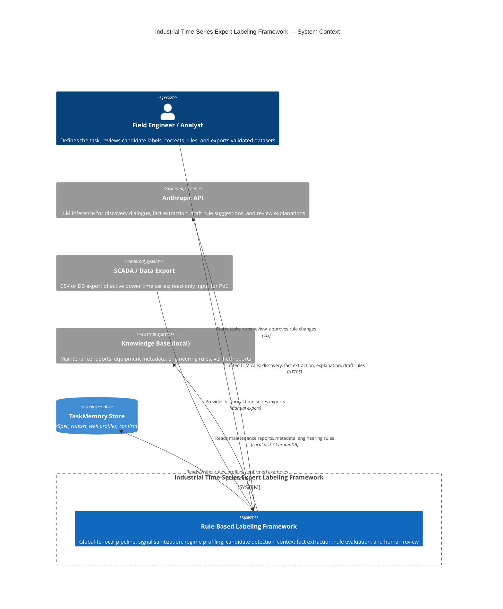

# C4 Context Diagram

Shows the system boundary, users, and external dependencies.

## Boundary Notes

- **In scope (PoC):** discovery dialogue, TaskSpec management, signal sanitization, regime profiling, candidate detection, fact extraction, rule-based labeling, review UI, persistent TaskMemory, structured logging
- **Out of scope (PoC):** real-time monitoring, production database integration, peer comparison in critical path, autonomous labeling, multi-user access control
- **Security boundary:** raw active power arrays never leave the local process; only report text and compact structured context are sent to the LLM API
- **Reference domain:** belt-break detection on rod pumping units; the framework is extensible to other deviation types and installation families
