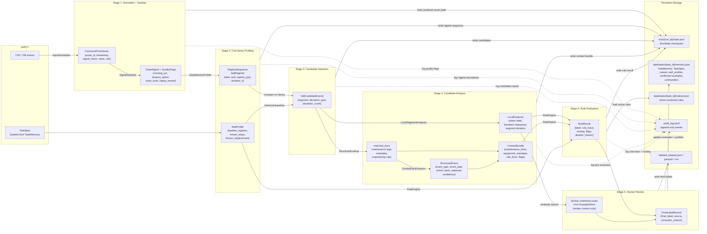

# Data Flow Diagram

How data is transformed, what is stored, and what is logged at each stage.

## What Goes to the LLM (and What Doesn't)

| Data | Sent to LLM? | Notes |
|------|-------------|-------|
| Raw `power_kW` time-series array | **No** | Never leaves signal processing engine |
| Full-series regime description | No | Computed deterministically and stored locally |
| Local candidate features | No for labeling; may be summarized for explanations only | Rule Engine consumes them directly |
| Maintenance report raw text | Yes | Only for `ContextFactExtractor`; parsed into StructuredFacts |
| Engineer correction patterns | Yes | Only for `RuleMiner` draft suggestion |
| Rule trace + final label | Yes | Only for human-readable explanation generation |
| Confirmed examples | No for label decision | Used only in review UI and regression testing |

## What Is Stored

| Store | Format | Retention | Access |
|-------|--------|-----------|--------|
| `runs/{run_id}/state.json` | JSON | Per run; retained for audit | PipelineRunner only |
| `audit_log.jsonl` | JSON Lines | Permanent; one file per run | Dev team, post-run analysis |
| `labeled_dataset.json` / exported dataset files | JSON / Parquet / CSV | Permanent; final output | Export to downstream ML pipeline |
| `data/tasks/{task_id}/memory.json` | JSON | Persistent; updated after every run | TaskManager and review flow |
| `data/tasks/{task_id}/ruleset.json` | JSON | Persistent; versioned | RuleRegistry |
| ChromaDB index | Binary (SQLite + embeddings) | Persistent; rebuilt via `build_index.py` | Retriever only |

## What Is Logged in `audit_log.jsonl`

Every entry includes `run_id`, `task_id`, `asset_id` or `candidate_id`, `stage`, `timestamp_utc`.

Stage-specific fields:

- **signal_sanitized:** `missing_pct`, `dropout_spans`, `clamp_events`
- **regimes_detected:** `change_point_count`, `regime_count`
- **candidates_found:** `candidate_count`, `deviation_types`
- **facts_extracted:** `doc_count`, `fact_count`, `confidence`
- **rule_result:** `label`, `winning_rule`, `rules_evaluated`, `rules_fired`, `conflict`, `routing`
- **human_action:** `action`, `proposed_label`, `final_label`, `correction_reason`
- **rule_added / rule_deactivated / regression_passed / regression_failed**
