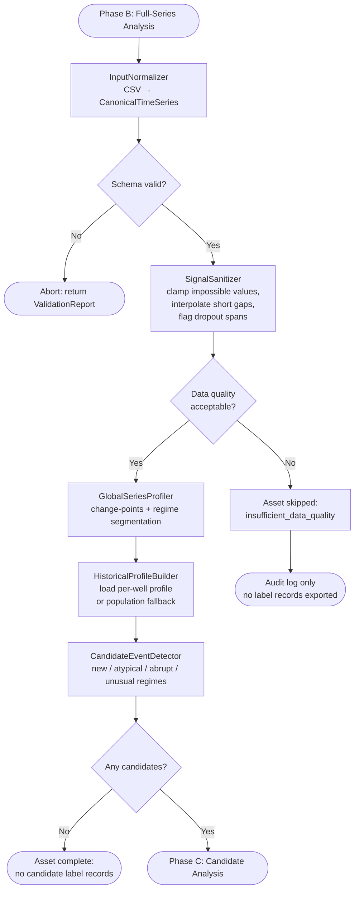
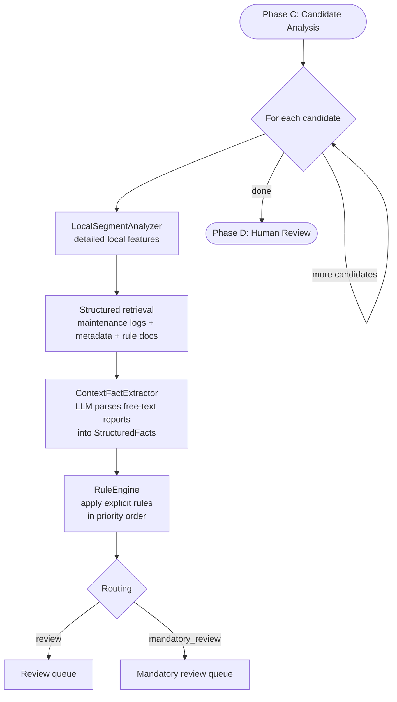
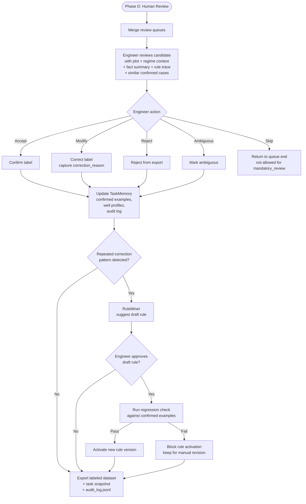

# Workflow / Graph Diagram

End-to-end execution flow for the rule-based global-to-local labeling pipeline.

## Phase A — Discovery and Task Setup

```mermaid
flowchart TD
    START([Engineer starts new labeling task]) --> CHECK_TASK{TaskSpec exists\nfor this task_id?}

    CHECK_TASK -->|No| DISCOVER[DiscoveryAgent\nelicitation dialogue with engineer]
    CHECK_TASK -->|Yes, complete| LOAD_SPEC[Load existing TaskSpec\nfrom TaskMemory]

    DISCOVER --> BUILD_SPEC[TaskSpec Builder\ncreates TaskSpec from TaskClarification]
    BUILD_SPEC --> ADAPTER{Known domain\npack exists?}
    ADAPTER -->|Yes| BOOTSTRAP[DomainAdapter.bootstrap()\nfills defaults for equipment family]
    ADAPTER -->|No| GENERIC[Use generic adapter\nand user-supplied schema]
    BOOTSTRAP --> SAVE_SPEC[Save TaskSpec to TaskMemory]
    GENERIC --> SAVE_SPEC
    LOAD_SPEC --> PHASE_B

    SAVE_SPEC --> PHASE_B([Phase B: Full-Series Analysis])
```

## Phase B — Full-Series Understanding



## Phase C — Candidate Analysis



## Phase D — Human Review and Rule Growth



---

## Key Design Decisions Visible in Workflow

| Decision | Where it appears |
|----------|-----------------|
| Discovery before labeling | Phase A is the mandatory entry point for new tasks |
| Full-series analysis before local analysis | Phase B profiles the entire asset before any candidate-level features are extracted |
| Candidate-first labeling | Phase C only analyzes candidate segments, not every window |
| Rule Engine is the decision authority | Rule application precedes every review path |
| Human review is mandatory in PoC v1 | All routed candidates go through Phase D |
| Confirmed examples are secondary memory | Used in review UI and regression checks, not as a decision mechanism |
| Rule growth replaces few-shot growth | Corrections lead to draft rules and regression-tested rule updates |

## Error Branch Summary

| Branch | Trigger | Outcome |
|--------|---------|---------|
| Abort | Input schema invalid | Entire run stops; ValidationReport printed |
| Asset skipped | Data quality too poor | Audit log only; no label records exported |
| No candidates | All regimes within historical profile | Asset complete; no candidate label records exported |
| Mandatory review | Rule conflict, `unknown` fallback, processing failure, hard flags | Engineer must resolve before session ends |
| Fact extraction failure | LLM parse/schema failure | Continue with raw docs visible in review |
| Regression failure | New rule breaks confirmed examples | Block rule activation |
